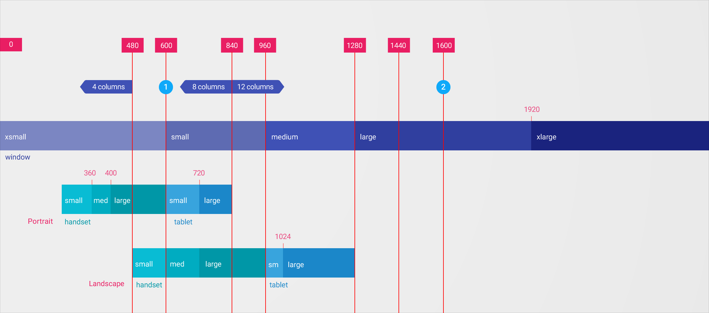

###### Front-End Design CAMP

-

### 제작 도구

- 그래픽 소프트웨어 ( [Sketch](https://www.sketchapp.com/) | [Photoshop](https://www.adobe.com/kr/products/photoshop.html) | [Illustrator](http://www.adobe.com/kr/products/illustrator.html) )
- 텍스트 에디터 ( [Brackets](http://brackets.io/) | [Sublime Text](https://www.sublimetext.com/3) )
- 웹 브라우저 ( [Chrome](https://www.google.co.kr/chrome/browser/desktop/) | [Firefox](https://www.mozilla.org/ko/firefox/new/) )

-

### 디자인 유형

- 모바일/데스크탑 전용 웹 페이지 (웹 표준, CSS 레이아웃)
- 반응형 웹 페이지 (웹 표준, CSS 레이아웃)
- 이메일 웹 페이지 (비 표준, Table 레이아웃)


-

### <abbr title="Responsive Web Design">RWD</abbr> 가이드라인

- [Google Resizer](http://design.google.com/resizer/)
- [Meterial UI - Breakpoints](https://www.google.com/design/spec/layout/responsive-ui.html#responsive-ui-breakpoints)



```
반응형 UI - 중단점(Breakpoint) 설계에 따른
레이아웃(Layout) 디자인 가이드

최적의 사용자 경험(UX)을 위한 중단점 설계 (Material Design)
480, 600, 840, 960, 1280, 1440, 1600

① 600을 기준 삼아...
600 이하의 경우는 싱글 레이아웃(콘텐츠 레벨이 복잡하지 않은 1계층)으로
Summary/Details View를 한 화면에 모두 제공하지 않는다. (독립적으로 제공)
600 이상의 경우는 멀티 레이아웃(복잡한 콘텐츠 레벨)으로 Summary/Details
View를 한 화면에 모두 제공할 수 있다.

② 1600 이상을 넘어가는 와이드 스크린의 경우는 상황에 따라 그리드 레이아웃이
변경될 수 있는데 크게 다음과 같은 방법으로 처리할 수 있다.

1. 가운데 정렬을 유지하면서 마진을 커지는 경우
2. 왼쪽에 정렬된 상태에서 오른쪽 공간이 커지는 경우
3. 콘텐츠가 추가되면서 레이아웃이 보다 복잡하게 변경되는 경우
```
